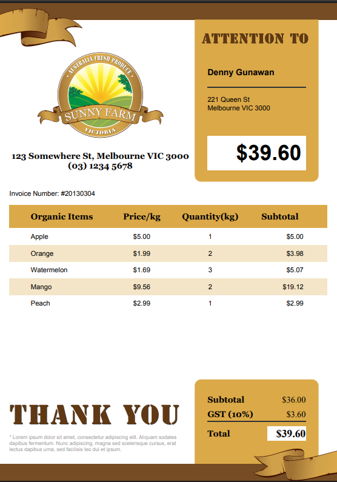
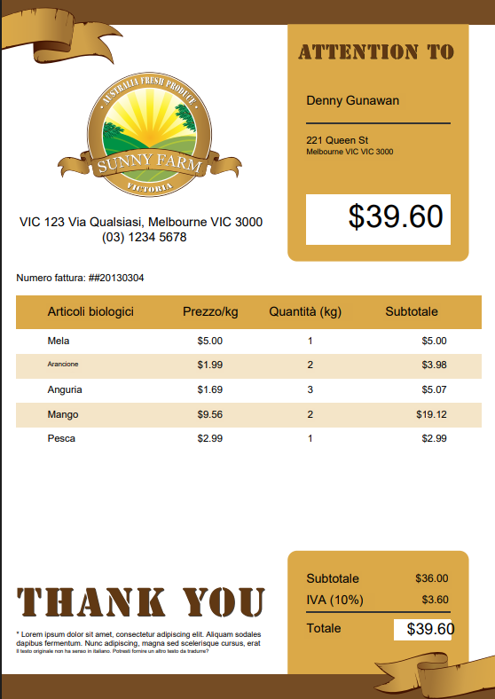

# PDF Translator Examples

This document showcases examples of the PDF Translator application in action, demonstrating how it preserves the original document's layout, formatting, and background colors while translating the text content.

## Translation Process

The PDF Translator follows these steps to create high-quality translated documents:

1. **Text Extraction**: Extracts text blocks from the original PDF while preserving their positions, font styles, and sizes
2. **Background Color Detection**: Identifies the background color of each text block to maintain the original document's appearance
3. **Translation**: Translates the extracted text using OpenAI's API
4. **Layout Preservation**: Places translated text in the exact same positions as the original text
5. **Visual Fidelity**: Maintains all original images, graphics, vectors, and other visual elements perfectly

## Example Translation

Below are examples of original and translated PDFs processed by our application.

### Original Document

The original document contains text in the source language with various formatting, background colors, and layout elements.

### Translated Document

The translated document preserves the exact layout, background colors, and formatting of the original, with only the text content changed to the target language.

## Key Features Demonstrated

1. **Background Color Preservation**: Notice how the background colors of text blocks in the original document are maintained in the translated version
2. **Font Style Preservation**: Bold and italic text formatting is preserved in the translation
3. **Layout Fidelity**: The exact positioning of text blocks is maintained
4. **Text Wrapping**: When translated text is longer than the original, intelligent text wrapping is applied while staying within the original text block boundaries

## Technical Implementation

The background color detection feature works by:

1. Analyzing the area around each text block in the original PDF
2. Identifying the most common color in that area (likely the background)
3. Using that exact color when covering the original text before adding the translation

This approach ensures that colored backgrounds, highlighted text, and other design elements are maintained in the translated document, making it visually identical to the original except for the text content.

## Real-time Progress Updates

The application provides real-time progress updates during the translation process via WebSocket communication, allowing users to monitor:

- Text extraction progress
- Translation progress for each page
- PDF generation progress

This ensures users are informed throughout the potentially time-consuming translation process, especially for large documents.
