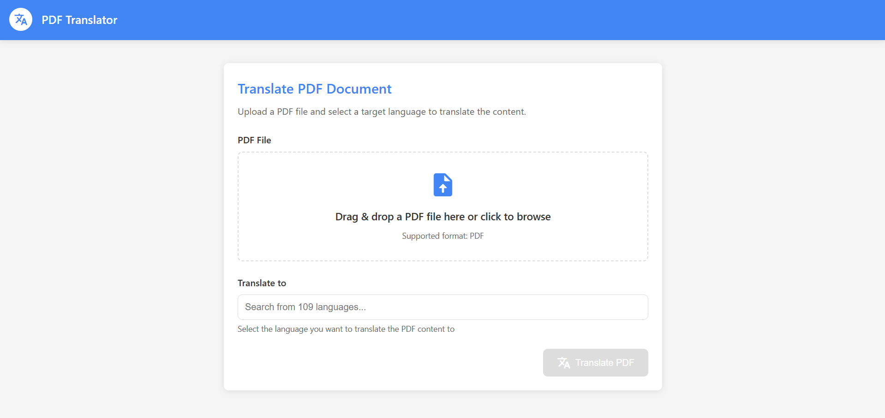
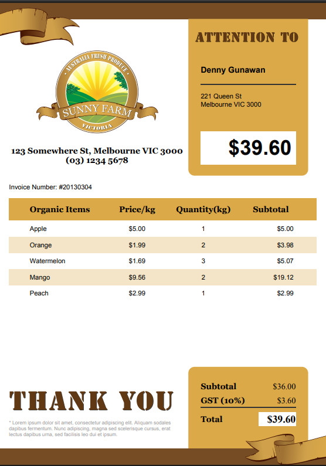
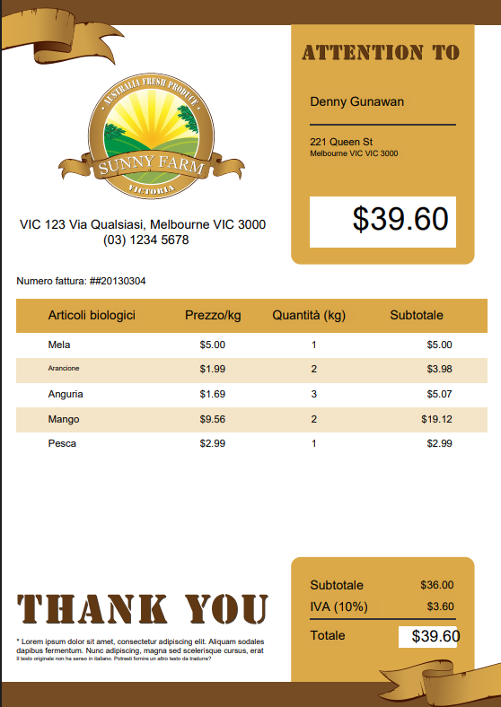

# PDF Translator

A powerful web application that translates PDF documents to various languages while preserving the original layout, formatting, and background colors.



## Features

- **Exact Layout Preservation**: Maintains the original PDF layout including text positioning, images, and graphics
- **Background Color Detection**: Preserves the background color of each text block in the translated document
- **Font Style Retention**: Maintains bold, italic, and other text formatting from the original document
- **Real-time Progress Updates**: Provides WebSocket-based progress tracking during translation
- **Multiple Language Support**: Translates to any language supported by OpenAI's models
- **Web Interface**: User-friendly interface for uploading and translating PDFs
- **Intelligent Text Wrapping**: Handles cases where translated text is longer than the original

## ⭐ Support This Project

If you find this project useful, please consider giving it a star on GitHub! Your support helps make this project better.

[](https://github.com/hashirkz/pdf-translator)

## 🤝 Contributing

Contributions are welcome and greatly appreciated! Here's how you can contribute:

1. Fork the repository
2. Create your feature branch (`git checkout -b feature/amazing-feature`)
3. Commit your changes (`git commit -m 'Add some amazing feature'`)
4. Push to the branch (`git push origin feature/amazing-feature`)
5. Open a Pull Request

Feel free to check the [Issues](https://github.com/hashirkz/pdf-translator/issues) page for any open tasks or report bugs.

## Translation Examples

### Original Document


### Translated Document


Notice how the application preserves:
- The exact layout and positioning of all elements
- Background colors of text blocks
- Font styles and formatting
- All images and graphical elements

## How It Works

The PDF Translator follows these steps:

1. **Text Extraction**: Extracts text blocks from the original PDF while preserving their positions, font styles, sizes, and page numbers
2. **Background Color Detection**: Analyzes each text block area to identify its background color
3. **Translation**: Sends the extracted text to OpenAI's API for translation
4. **PDF Recreation**: Creates a new PDF by:
   - Copying the original PDF pages exactly
   - Covering original text with rectangles matching the detected background color
   - Adding translated text in the same positions with matching font styles
5. **Progress Tracking**: Provides real-time updates throughout the process via WebSocket communication

## Installation

### Prerequisites
- Python 3.8+
- OpenAI API key

### Setup

1. Clone this repository:
```bash
git clone https://github.com/hashirkz/pdf-translator.git
cd pdf-translator
```

2. Install the required dependencies:
```bash
pip install -r requirements.txt
```

3. Create a `.env` file in the project directory with your OpenAI API key:
```
OPENAI_API_KEY=your_openai_api_key_here
```

## Usage

### Web Interface

1. Start the web server:
```bash
python main.py
```

2. Open your browser and navigate to `http://localhost:8000`

3. Upload a PDF file, select the target language, and click "Translate"

4. Monitor the real-time progress updates during translation

5. Download the translated PDF when complete

### API Endpoints

The application provides the following API endpoints:

- `POST /translate-pdf`: Upload and translate a PDF file
- `GET /download/{filename}`: Download a translated PDF file
- `WebSocket /ws/{task_id}`: Connect to receive real-time progress updates

## Technical Implementation

### Background Color Detection

The application detects the background color of each text block by:

1. Rendering a small area around the text block as an image
2. Analyzing the color distribution to find the most common color
3. Using that color when covering the original text before adding the translation

This ensures that colored backgrounds, highlighted text, and other design elements are maintained in the translated document.

### Text Wrapping

When translated text is longer than the original (common in many language pairs), the application:

1. Calculates the available space in the original text block
2. Estimates how many characters can fit per line
3. Applies intelligent word wrapping to keep the text within the original boundaries
4. Adjusts line spacing as needed to accommodate the text

## Limitations

- Very complex PDF layouts with mixed text directions might require manual adjustment
- PDFs with custom fonts will use standard substitutes in the translated version
- Documents with text embedded in images require separate OCR processing (not included)

## Contributing

Contributions are welcome! Please feel free to submit a Pull Request.

## License

This project is licensed under the MIT License - see the LICENSE file for details.

## Acknowledgments

- OpenAI for providing the translation API
- PyMuPDF (fitz) for PDF processing capabilities
- FastAPI for the web framework
